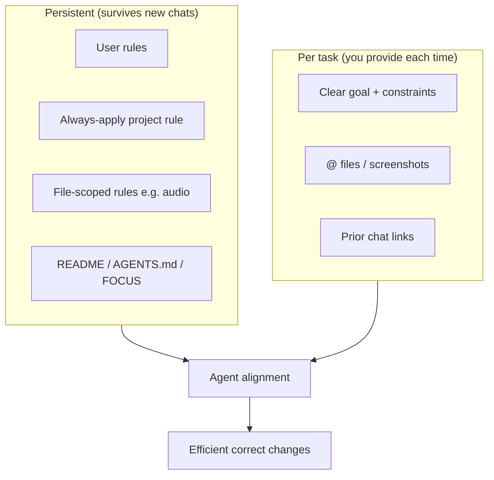

You can get a lot more alignment with less repetition by treating context in **layers**: stable project identity, file-specific conventions, and per-task intent. Your repo already has pieces of this — the gap is mostly a **project map** and **codified workflows** beyond audio.

## How I actually use context

Each chat starts mostly fresh. I can read your codebase, but I do not automatically retain prior sessions unless you give me:

1. **Always-on context** — Cursor rules, user rules, open files  
2. **On-demand context** — README, docs, `@`-mentioned files  
3. **Task context** — what you say in the current message  

The goal is to put **stable truths** in layers 1–2 and keep layer 3 for **what you want changed today**.

---

## What you already do well

**README.md** covers run commands, layout, and git workflow — good baseline.

**`.cursor/rules/audio-gain-normalization.mdc`** is an excellent template. It has:

- When the rule applies (file globs + triggers)  
- Required follow-up steps (`npm run refresh-audio`)  
- Source-of-truth vs generated files  
- Concrete “don’t skip this” instructions  

That pattern is worth copying for other subsystems.

---

## Recommended context stack for Pick A Flick

### 1. A short “always apply” project rule (~30–50 lines)

Something like `pick-a-flick-overview.mdc` with `alwaysApply: true` that answers:

- **What it is:** Neon arcade movie wheel; spin → category → movie → ticket-style result + synced audio  
- **Stack:** Static HTML/JS/CSS; no build step for the app itself  
- **Big files:** `main.js` is ~6,500 lines and holds most UI/game logic  
- **Source of truth vs generated:**

| Edit this | Not this (regenerated) |
|-----------|-------------------------|
| `main.js` → `movieDatabase` | `movie-metadata.js` |
| `scripts/audio-paths.mjs` | `audio-paths.js` |
| `scripts/win-clip-categories.mjs` + `audio/win/<category>/` | `win-clips-manifest.js` |
| (after clip changes) run refresh | `audio-gain-map.js` |

- **Dev server:** `scripts/serve-static.ps1` (needed for fetch/audio)  
- **Style constraint:** Match existing patterns; avoid drive-by refactors in `main.js`

This alone prevents a lot of “edited the wrong file” mistakes.

### 2. Subsystem rules (file-scoped, like your audio rule)

One concern per rule, triggered by globs:

| Rule topic | Globs | What to capture |
|------------|-------|-----------------|
| Movie lists | `main.js` | Listing format `"Title (Year)"`, series syntax, where to add/remove, then `npm run generate-metadata:ps` |
| Metadata | `movie-metadata.js`, `scripts/generate-*` | OMDb key in `.env`, never hand-edit generated file |
| Shuffle minigame | `main.js` (shuffle section), `style.css` | Key constants, audio paths, timing constants |
| Keeper deck | same | 3-slot behavior, ticket-stubs flow |
| Coin toss | same | Slot assignment, flip audio |
| Tix Mix / themes | `graphics/tix-mix/`, `style.css` | Visual direction (Mario Party–inspired title cards, not asset copies) |

Your audio rule already shows the right shape: **trigger → source of truth → required commands → verification**.

### 3. An `AGENTS.md` or expanded README section: “Architecture map”

Because `main.js` is monolithic, a **navigation map** helps more than more prose. Even a rough outline:

```markdown
## main.js map (approximate)
- L1–350: movieDatabase, category filters
- L350–850: spin flow, cabinetMixer, win clip rotation
- L850–1200: result card, posters, metadata lookup
- L1700–2300: Keeper deck, add-movies UI
- L2330–4200: Ticket shuffle minigame
- L4200–5700: Coin toss
- L5700+: Ticket stubs, keyboard shortcuts, init
```

You do not need perfect line numbers — **region names + entry functions** (`initiateSpin`, `launchTicketShuffle`, `armCoinToss`, etc.) are enough for me to jump to the right area quickly.

### 4. A living “current focus” note (optional but high leverage)

A small `docs/FOCUS.md` or a README section you update when priorities shift:

```markdown
## Current focus (July 2026)
- Tix Mix title-card themes for shuffle intro
- Normalizing new cage_stage win clips
- NOT touching: coin toss timing (stable)
```

That keeps evolving work visible without rewriting rules every week.

### 5. Integrate brainstorm docs into the workflow

`docs/TIX-MIX-THEMES.md` is useful creative context but isolated. Either:

- Reference it from a Tix Mix rule (“see `docs/TIX-MIX-THEMES.md` for theme vocabulary”), or  
- `@docs/TIX-MIX-THEMES.md` when asking for theme-related work  

Otherwise I may not know it exists.

---

## How to phrase requests (biggest day-to-day win)

**Weak (I have to guess scope):**
> “Make the shuffle feel better.”

**Strong (aligned quickly):**
> “In the ticket shuffle minigame (`launchTicketShuffle` area in `main.js`): slow the golden-ticket reveal by ~200ms and use the existing `SHUFFLE_*` timing constants. Do not refactor shuffle into modules. Match current animation style in `style.css`. After any audio path change, run refresh-audio.”

A good task message usually includes:

1. **Subsystem** — spin / shuffle / keeper / coin toss / audio / movies  
2. **Success criteria** — what “done” looks like (visual, audio, behavior)  
3. **Constraints** — “minimal diff”, “don’t touch X”, “no refactor”  
4. **Files to prefer** — or `@`-mention them  
5. **Follow-up commands** — metadata regen, audio refresh, etc.

---

## Workflow patterns that scale as the project evolves

### Capture decisions as rules after repeated friction

When you correct me twice on the same thing (“always run metadata after adding movies”, “draft clips go in `_staging`”), that belongs in a `.mdc` rule — not only in chat history.

### One chat ≈ one coherent task

Mixed requests (“fix shuffle AND add 10 movies AND tweak keeper audio”) dilute focus. Separate chats (or numbered sub-tasks in one message) work better.

### Use branches for experiments

Your README already suggests feature branches. Branch names like `tix-mix-beach-theme` or `shuffle-timing-tweak` give me git context and reduce risk to `main`.

### Reference prior chats when continuing work

> “Continuing [shuffle golden ticket timing](<chat-id>) — now apply the same easing to row-align.”

That bridges session boundaries.

### Attach screenshots or screen recordings for feel

For arcade UI and timing, a 5-second clip or screenshot beats a paragraph of adjectives.

### `@` the right anchors

- `@main.js` + “shuffle section only”  
- `@scripts/audio-paths.mjs` for UI sound changes  
- `@.cursor/rules/audio-gain-normalization.mdc` when adding clips  

---

## Specific to your codebase

A few facts worth encoding in rules because they are easy to get wrong:

1. **Movies live in `movieDatabase` inside `main.js`** — not in `movie-metadata.js`. The app even generates copy-paste prompts for add/remove flows around lines 1814–2000.  
2. **Category names must match across** `movieDatabase`, `win-clip-categories.mjs`, and `audio/win/<folder>/`.  
3. **Audio has two pipelines:** UI paths (`audio-paths.mjs` → sync) and win clips (folder scan → manifest → gain map). Your existing rule covers this well.  
4. **`main.js` is intentionally monolithic** — say explicitly if you want it to stay that way; otherwise I may suggest splitting it.  
5. **Large asset folders** (`audio/_staging/`, `graphics/tix-mix/`) are not fully indexed in git status snapshots — mention which assets matter for the task.

---

## Suggested priority order

If you want maximum ROI with minimal upkeep:

1. **Always-on overview rule** (stack, generated files, dev server)  
2. **main.js subsystem map** (even rough)  
3. **Movie-list rule** (format + metadata regen)  
4. **Clone the audio rule pattern** for the next pain point (shuffle? metadata?)  
5. **FOCUS.md** — update when priorities change  

---

## Visual: context layers



---

If you want, switch to **Agent mode** and I can draft the overview rule, a `main.js` map, and a movie-metadata rule using your existing audio rule as the template — without changing app behavior, just the workflow layer.